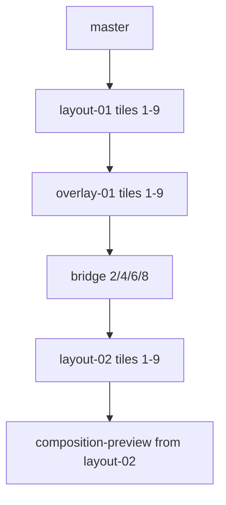

# Layout calibration pass (robot pipeline)

## Goal

Implement the **layout calibration pass**: after each initial tile generation (`layout-01`), assemble that tile with its **157-series R1 map** (opacity already baked into the PNG), then run a second OpenAI edit pass using `framework/prompts/layout-calibration-pass.md` to produce **`layout-02`** tiles. Bridges use **layout-01** neighbors; the **composition preview** uses **layout-02**. Terminology stays **layout calibration** (not R2—R2 remains style/palette in canon).

## Current baseline (already in repo)

- R1 maps: `images/refs/R1/157-tile*.png` (9 files present)
- Config: `robot/recipes/generate-panorama/config.json` points `compositionMapsR1` at `157-tile*.png`, `fileIndex` 273, `samplePaddingZeroes` 3
- Recipe builder: `robot/recipes/generate-panorama/generate-panorama.ts` — single-pass tiles with suffix `-001-tileN` (will change)
- Overlay capability exists: `image.assemble-layers` in `robot/src/services/image/image.ts` (opacity optional; omit at assembly time)
- No `enabled` on steps yet; runner always runs every task

## Target file-index sequence (per sample)



Example filenames (one sample):

| Step | Pattern |
|------|---------|
| Master | `012-0274-sample-001-master.png` |
| Layout 01 | `012-0275-sample-001-layout-01-tile1.png` … `0283-tile9` |
| Overlay 01 | `012-0284-sample-001-overlay-01-tile1.png` … `0292-tile9` |
| Bridges | `012-0293-sample-001-bridge-tile-2.png` … `0296-tile-8` |
| Layout 02 | `012-0297-sample-001-layout-02-tile1.png` … `0305-tile9` |
| Panorama strip | `012-0306-sample-001-composition-preview.png` (next index after layout-02; allocate sequentially) |

## Execution order (recipe steps)

Per sample, match the agreed ordering. **Tertiary layout-01 runs before bridges** (pass-1 tiles 2/4/6/8 show `(not uploaded)` for `bridge.png`, same as today when bridge is missing):

1. **Master** (`openai.generate-image`)
2. **Layout-01 tiles** in workflow order: 5 → 1, 9 → 3, 7 → 2, 4, 6, 8 (all outputs are `layout-01-*`)
3. **Overlay-01** × 9: `image.assemble-layers` per tile
   - `inputs: [layout01FullPath, r1Paths[tile]]` — no `opacity`, no custom `position` (defaults)
4. **Bridges** × 4: `image.create-bridge` — **left/right = layout-01** tile paths (not layout-02)
5. **Layout-02 calibration** × 9 (gated by `layoutCalibrationPass.enabled`):
   - Overlay file is sole `inputImages` for the calibration generate step
   - Prompt from `layout-calibration-pass.md` with replacements:
     - `` `tile.png` `` → **generated** layout-01 filename (e.g. `012-….-layout-01-tile1.png`)
     - `` `r1-composition-map.png` `` → config map filename (e.g. `157-tile1.png`)
   - For tiles 2/4/6/8 layout-02: prompt still replaces `` `bridge.png` `` with bridge file; ruler from **layout-02 tile5** path
6. **Composition preview**: `image.compose-tiles` input = **layout-02** paths (1→9)
7. **PREVIEW.md inserts** (see below)
8. **framework/README.md** composition insert (unchanged; uses composition-preview path)

When `layoutCalibrationPass.enabled` is false: skip overlay + layout-02 + calibration steps; bridges and preview fall back to layout-01 only (define clearly in builder).

## Naming refactor (`generate-panorama.ts`)

- Change sample token from `001` to **`sample-001`**:
  - `const paddedSample = \`sample-${padZeroes(sampleIdx, recipeConfig.samplePaddingZeroes)}\`;`
- Replace flat `entries.tile1Image` with explicit keys, e.g.:
  - `masterImage`, `layout01Tile1` … `layout01Tile9`, `overlay01Tile1` … `overlay01Tile9`, `layout02Tile1` … `layout02Tile9`, bridges, `compPreviewImage`
- `alloc(segment: string)` → `basePrefix = ${filePrefix}-${padZeroes(idx)}`, `canonicalPrefix = ${basePrefix}-${paddedSample}-${segment}`, `outputSuffixes = [-${paddedSample}-${segment}]`
- Update `BRIDGE_COMPOSITIONS` to reference **layout01** tile keys
- `buildLayout01TileStep` (suffix `layout-01-tileN`)
- `buildOverlayStep`, `buildLayoutCalibrationStep` (suffix `layout-02-tileN`)

## Config and schema

Extend `robot/recipes/generate-panorama/config.json` and `config.schema.ts`:

```json
"layoutCalibrationPass": {
  "enabled": true,
  "promptFile": "layout-calibration-pass.md"
},
"addToPreviewTableRowPre": true,
"addToPreviewTableRowPost": true,
"addToPreviewTableRowOverlay": true,
"addToPreviewTableRowPanorama": true
```

- `layoutCalibrationPass.promptFile` nested under `layoutCalibrationPass`; read as `promptFolder` + prompt file name
- No `r1OverlayOpacity`
- Update `robot/tests/unit/generate-panorama-config.schema.test.ts` for new keys

## New prompt file

Create `framework/prompts/layout-calibration-pass.md`:

- Paste-ready only (no title), like tile prompts
- Reference placeholders: `` `tile.png` ``, `` `r1-composition-map.png` ``
- Instruct: attached image is generated tile + visible composition guide; re-render photorealistic; match horizon/envelope; remove guide artifacts; preserve tile identity and lighting; no extra sky / no vertical recenter

## Step `enabled` flag

| File | Change |
|------|--------|
| `robot/src/types/step.ts` | `StepBase.enabled?: boolean` |
| `robot/src/types/task.ts` | `enabled?: boolean` (optional on persisted tasks) |
| `robot/src/builder.ts` | `stepToTask` copies `enabled` |
| `robot/src/types/plan.ts` | `planSchema` optional `enabled` on tasks |
| `robot/src/runner.ts` | If `task.enabled === false`, log skip, mark `success` (so resume does not retry) |

Default in recipe builder: omit `enabled` or set `true`. Set `enabled: recipeConfig.layoutCalibrationPass.enabled` on overlay, calibration, and layout-02-related steps only.

## PREVIEW.md rows

Desired order **top → bottom** (newest insert closest to header): **layout-02**, **overlay**, **layout-01**.

Because inserts use `position: "after"` on `<!-- robot:table-tiles-header-end -->` in `images/PREVIEW.md`, use **reverse chronological insert order**:

1. Insert layout-01 row + labels (`addToPreviewTableRowPre`)
2. Insert overlay row + labels (`addToPreviewTableRowOverlay`)
3. Insert layout-02 row + labels (`addToPreviewTableRowPost`)

Compositions table at top: marker `<!-- robot:table-compositions-header-end -->`; insert gated by `addToPreviewTableRowPanorama` (composition-preview from **layout-02**).

No change to framework README composition block logic beyond preview path pointing at latest composition-preview file.

## Tests and verification

- Unit: config schema parses new flags; default/invalid values
- Unit: runner skips `enabled: false` tasks
- Unit or snapshot: recipe `buildRecipe` step count / titles when calibration enabled vs disabled
- Manual: `./robot/bin/robot build --recipe generate-panorama` — inspect plan JSON for suffixes and step order
- Manual: run sample with calibration on; confirm overlays on disk and layout-02 horizon alignment vs layout-01

## Out of scope (this PR)

- Promoting layout calibration into `framework/docs/04_operational_pipeline.md` (wait until pass proves useful)
- Changing R1 map artwork (157 series is input)
- `openai.edit-image` as separate taskId (reuse `generate-image` with `inputImages` → edits endpoint)

## Risks

| Risk | Mitigation |
|------|------------|
| Layout-01 tertiary without bridges | Expected per index order; layout-02 tertiary gets bridges |
| 2× API cost per tile | `layoutCalibrationPass.enabled` toggle |
| Insert order in PREVIEW | Reverse insert order + boolean flags |
| Plan resume after partial run | Skipped-disabled tasks marked success; document for resume |

## Implementation todos

- [ ] Add optional `enabled` to Step/Task, plan schema, stepToTask, runner skip logic
- [ ] Extend config.json/schema: `layoutCalibrationPass`, four `addToPreviewTableRow*` booleans, `promptFile`
- [ ] Add `framework/prompts/layout-calibration-pass.md` with `tile.png` and `r1-composition-map.png` placeholders
- [ ] Refactor `generate-panorama.ts`: `sample-NNN` suffixes, layout-01/overlay/layout-02 alloc, step builders, execution order, bridge wiring
- [ ] Wire PREVIEW inserts (pre/overlay/post/panorama flags) in reverse insert order for correct row stacking
- [ ] Update config schema test; add runner enabled-skip test; verify build output
